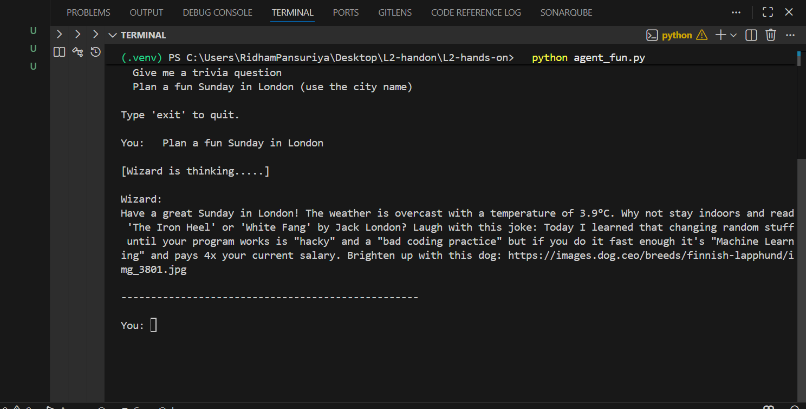

# Weekend Wizard 🧙

A friendly CLI agent that plans your weekend — powered by **MCP (Model Context Protocol)** and **Groq** (free cloud LLM). It fetches real-time weather, book recommendations, a joke, and a dog photo, then composes a cheerful mini-itinerary just for you.

---

## Screenshot

<!-- Add your terminal screenshot here -->


---

## Demo

<!-- Paste your terminal transcript or add a screen recording GIF here -->
```
# Example session will go here after recording
```

---

## Architecture

```
User  <-->  Agent (Groq LLM + ReAct loop)
                |
                v
          MCP Client (stdio)
                |
                v
        MCP Tools Server (server_fun.py)
        |        |        |        |        |
   weather   books     joke    dog pic  trivia
 (Open-Meteo)(OpenLib)(JokeAPI)(DogCEO)(OpenTDB)
        +
   city_to_coords (Open-Meteo Geocoding)
```

The agent uses the **ReAct pattern** — it decides which tools to call at runtime, observes the results, and decides when to stop. A one-shot **reflection pass** checks the final answer before showing it to you.

---

## Features

- **Weather** — current temperature, conditions, wind speed (Open-Meteo)
- **Book Recommendations** — search by topic (Open Library)
- **Joke** — safe, family-friendly one-liner (JokeAPI)
- **Dog Photo** — random dog image URL for good vibes (Dog CEO)
- **Trivia** — multiple-choice question (Open Trivia DB)
- **City to Coordinates** *(stretch goal)* — type a city name instead of coordinates (Open-Meteo Geocoding)
- **Retry logic** *(stretch goal)* — exponential backoff on rate-limited API calls

> All APIs are **free and require no API key**.

---

## Tech Stack

| Layer | Technology |
|-------|-----------|
| LLM   | Groq — `llama-3.3-70b-versatile` (free) |
| Agent Protocol | MCP (Model Context Protocol) `>=1.2` |
| Agent Style | ReAct + one-shot reflection |
| APIs | Open-Meteo, Open Library, JokeAPI, Dog CEO, Open Trivia DB |
| Language | Python 3.10+ |

---

## Project Structure

```
weekend-wizard/
├── server_fun.py      # MCP tools server (all tool definitions)
├── agent_fun.py       # Agent client (LLM loop + tool calls)
├── requirements.txt   # Python dependencies
├── .env.example       # API key template
├── .env               # Your keys (not committed to git)
└── README.md          # This file
```

---

## Setup

### 1. Get a Free Groq API Key

1. Go to [https://console.groq.com](https://console.groq.com)
2. Sign up (free, no credit card required)
3. Click **API Keys → Create API Key**
4. Copy the key — it starts with `gsk_...`

### 2. Create & Activate Virtual Environment

```bash
# Windows
python -m venv .venv
.venv\Scripts\activate

# Mac / Linux
python -m venv .venv
source .venv/bin/activate
```

### 3. Install Dependencies

```bash
pip install -r requirements.txt
```

### 4. Configure API Key

```bash
# Windows
copy .env.example .env

# Mac / Linux
cp .env.example .env
```

Open `.env` and replace the placeholder with your real key:

```env
GROQ_API_KEY=gsk_your_actual_key_here
```

---

## Running the Agent

```bash
python agent_fun.py
```

The agent will:
1. Spawn `server_fun.py` automatically as a subprocess (stdio MCP server)
2. List all available tools
3. Wait for your prompt

---

## Example Prompts

```
Plan a cozy Saturday in NYC at (40.7128, -74.0060) with mystery books
```

```
Plan a fun Sunday in London
```

```
What is the weather at (37.7749, -122.4194)? Keep it brief.
```

```
Give me one trivia question
```

```
Suggest 3 sci-fi books and crack a joke
```

---

## How It Works (ReAct Loop)

```
User prompt
    │
    ▼
LLM decides: call a tool?
    │
    ├─ YES → {"action": "tool_name", "args": {...}}
    │           │
    │           ▼
    │        MCP tool executes → result added to history
    │           │
    │           └──► back to LLM decision
    │
    └─ NO  → {"action": "final", "answer": "..."}
                │
                ▼
          Reflection pass (checks completeness)
                │
                ▼
          Final answer shown to user
```

---

## Configuration

You can customise behaviour via environment variables in `.env`:

| Variable | Default | Description |
|----------|---------|-------------|
| `GROQ_API_KEY` | *(required)* | Your Groq API key |
| `GROQ_MODEL` | `llama-3.3-70b-versatile` | Any Groq-supported model |

### Alternative Free Models

```env
GROQ_MODEL=llama3-8b-8192          # Faster, lighter
GROQ_MODEL=mixtral-8x7b-32768      # Good instruction following
GROQ_MODEL=llama-3.1-8b-instant    # Fastest response time
```

---

## Assignment Checklist

- [x] Tools server runs and each tool returns sensible data
- [x] Agent connects to the server and lists tools
- [x] Agentic loop — agent calls tools, observes, then decides to finish
- [x] Reflection pass — confirms or improves the final answer
- [x] Responses are concise, friendly, and reference fetched data
- [x] Stretch: `city_to_coords` tool (type a city instead of coordinates)
- [x] Stretch: Retry logic with exponential backoff on all API calls

---

## Troubleshooting

| Problem | Fix |
|---------|-----|
| `GROQ_API_KEY not set` | Create `.env` from `.env.example` and add your key |
| `ModuleNotFoundError: mcp` | Run `pip install -r requirements.txt` inside `.venv` |
| `Network timeout` | Tools have automatic retry — just re-run your prompt |
| `JSON parse error` | The agent has a built-in JSON repair step; try rephrasing |
| `City not found` | Try a more specific city name e.g. `"London, UK"` |

---

## License

MIT — free to use, modify, and submit for your assignment.
